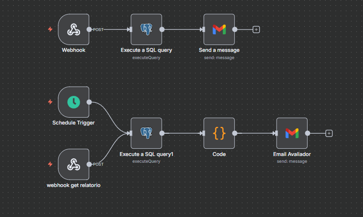
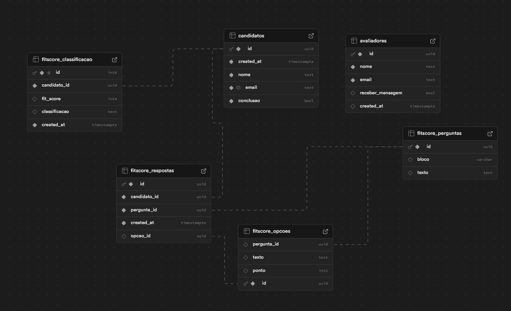

🚀 Mini FitScore

Sistema MVP de quiz desenvolvido para o desafio PSL Legal com foco em RH.
Link do desafio

Aplicação web
 
🛠 Tecnologias

Next.js (TypeScript) → Frontend reativo e performático

Lucide Icons → Ícones leves e modernos

Axios → Cliente HTTP para APIs

Supabase → Autenticação e banco de dados PostgreSQL

AuthContext → Gerenciamento de usuários

n8n → Orquestração de automações (webhooks, schedule triggers, email)

PostgreSQL → Procedures/functions para análise e classificação

🏗 Arquitetura e Fluxo Técnico

Camadas do projeto:

App (Next.js)

Interface do usuário, usando AuthContext

Chama os services para lógica de negócio

Service

Implementa regras de negócio

Encaminha requisições aos repositories

Repository

Centraliza chamadas ao Supabase/Postgres (CRUD e procedures)

n8n (Automação)

Webhook → Recebe respostas do candidato e dispara procedure para calcular pontuação

Webhook + Schedule Trigger → Geração de relatórios por avaliador ou agendada

PostgreSQL (Procedures/Functions)

Função inserir_respostas_e_classificacao:

Recebe JSON com respostas do candidato

Insere respostas, ignorando duplicadas

Calcula fit_score somando pontos das opções válidas

Determina a classificação (Fit Altíssimo, Fit Aprovado, Fit Questionável, Fora do Perfil)

Insere classificação na tabela fitscore_classificacao se ainda não existir

Atualiza candidatos.conclusao = true

Retorna true ao final

🔄 Estrutura do Banco e Relacionamentos
Tabelas principais:

candidatos → Armazena dados do candidato e status de conclusão

fitscore_perguntas → Perguntas do quiz

fitscore_opcoes → Opções de resposta, vinculadas a perguntas

fitscore_respostas → Respostas do candidato, vinculadas a perguntas e opções

fitscore_classificacao → Classificação final de cada candidato

avaliadores → Recrutadores que recebem relatórios

Relacionamentos:

fitscore_respostas.candidato_id → candidatos.id

fitscore_respostas.pergunta_id → fitscore_perguntas.id

fitscore_respostas.opcao_id → fitscore_opcoes.id

fitscore_opcoes.pergunta_id → fitscore_perguntas.id

fitscore_classificacao.candidato_id → candidatos.id

🔄 Fluxos de Processo
Processo do Candidato

O candidato preenche o formulário → envia para webhook n8n

n8n aciona procedure inserir_respostas_e_classificacao

Procedure:

Valida respostas existentes

Insere novas respostas

Calcula pontuação (fit_score)

Determina classificação

Atualiza candidatos.conclusao = true

n8n envia email para o candidato com resultados

✅ Processo finalizado

Geração de Relatórios

Webhook manual → Recebe avaliador_id → gera relatório para o avaliador específico

Schedule Trigger (automático) → Executa a cada 12h → gera relatório de todos os candidatos para todos os avaliadores

SQL usado para gerar relatório:
WITH aprovados AS (
  SELECT 
      c.nome AS candidato_nome,
      c.email AS candidato_email,
      f.fit_score,
      f.classificacao
  FROM fitscore_classificacao f
  INNER JOIN candidatos c ON f.candidato_id = c.id
  WHERE f.fit_score >= 80
    AND f.created_at >= NOW() - INTERVAL '12 hours'
)
SELECT 
  (
      SELECT json_agg(
          json_build_object(
              'email', av.email,
              'nome', av.nome,
              'mensagem', 
                  'Olá ' || av.nome || ',' || chr(10) || chr(10) ||
                  'Segue a lista de candidatos aprovados no Fit Score nas últimas 12 horas.' || chr(10)  
          )
      )
      FROM avaliadores av
      WHERE av.receber_mensagem = true
        {{ $json?.body?.[0]?.avaliador_id ? "AND av.id = '" + $json.body[0].avaliador_id + "'" : "" }}
  ) AS avaliadores,
  
  (
      SELECT json_agg(
          json_build_object(
              'nome', ap.candidato_nome,
              'email', ap.candidato_email,
              'escore', ap.fit_score,
              'classificacao', ap.classificacao
          )
      )
      FROM aprovados ap
  ) AS candidatos;

🖼 Diagramas
1️⃣ Fluxo do n8n

Webhooks e Schedule Triggers

Integração com Postgres e envio de emails

2️⃣ Modelo de Dados

Mostra tabelas candidatos, fitscore_perguntas, fitscore_opcoes, fitscore_respostas, fitscore_classificacao e avaliadores

Relacionamentos e integridade referencial

⚙️ Configuração de Variáveis de Ambiente

Crie .env.local na raiz:

NEXT_PUBLIC_SUPABASE_URL=your_supabase_url
NEXT_PUBLIC_SUPABASE_ANON_KEY=your_supabase_anon_key
NEXT_PUBLIC_N8N_BASE_URL=your_n8n_url
PORT=8000